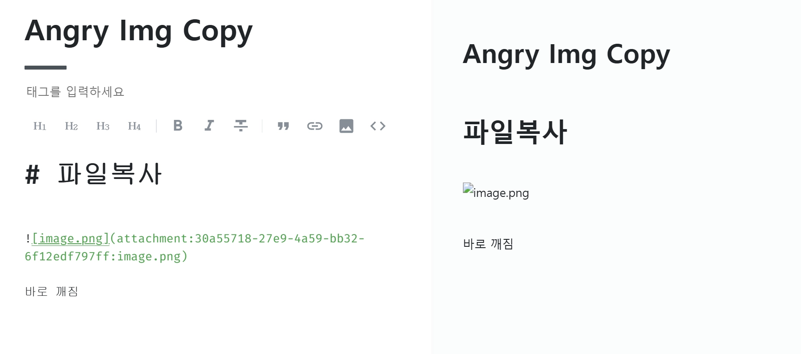

# Notion to Velog

**한국어** | [English](README.md)

노션 콘텐츠를 이미지 자동 업로드와 함께 벨로그에 바로 붙여넣기하는 크롬 확장 프로그램.



노션은 이미지를 `` 형식으로 복사합니다. 벨로그는 이 형식을 렌더링하지 못해 이미지가 깨집니다. 이 확장 프로그램은 `velog.io/write`의 붙여넣기 이벤트를 인터셉트해 각 이미지를 벨로그 CDN에 업로드한 뒤 URL을 교체하고 에디터에 삽입합니다.

---

## 요구 사항

- Chrome 또는 Brave 브라우저
- [Notion Integration Token](https://www.notion.so/my-integrations)
- [velog.io](https://velog.io) 로그인 상태

---

## 설치

1. 이 저장소를 클론하거나 다운로드
2. 브라우저에서 `chrome://extensions` 열기
3. 우측 상단 **개발자 모드** 활성화
4. **압축 해제된 확장 프로그램을 로드합니다** 클릭 후 프로젝트 폴더 선택

---

## 초기 설정

### 1. Notion Integration 생성

1. [notion.so/my-integrations](https://www.notion.so/my-integrations) 접속
2. **새 통합 만들기** 클릭 후 이름 입력
3. **Internal Integration Token** (`ntn_...`) 복사

### 2. Notion 페이지에 Integration 연결

복사할 노션 페이지마다:

1. 노션 페이지 우측 상단 **···** 클릭
2. **Connections** → 생성한 Integration 선택

### 3. 확장 프로그램에 토큰 저장

브라우저 툴바에서 확장 아이콘을 클릭해 토큰을 붙여넣고 **저장**을 누릅니다.

---

## 사용 방법

1. 게시할 노션 페이지 열기
2. `Ctrl+A` → `Ctrl+C` 로 전체 복사
3. `velog.io/write` 에서 `Ctrl+V` 붙여넣기
4. 이미지가 자동으로 업로드되고 완성된 마크다운이 에디터에 삽입됩니다

화면 우하단에 진행 상황과 결과를 알려주는 토스트 알림이 표시됩니다.

---

## 동작 원리

```
notion.so                    background.js               velog.io/write
─────────────────────────────────────────────────────────────────────────
notion-content.js가          FETCH_IMAGE:                content.js가 붙여넣기
img[src] 스캔 →              Notion API → S3 URL →       이벤트 인터셉트 →
UUID→URL 맵을                바이너리 다운로드            attachment URL을
chrome.storage.local에 저장                              CDN URL로 교체 →
                             UPLOAD_TO_VELOG:            에디터에 마크다운 주입
                             executeScript(MAIN world)
                             → POST /api/v2/files/upload
                             → CDN URL 반환
```

**업로드에 MAIN world를 사용하는 이유**
벨로그 업로드 API는 `access_token` 쿠키와 same-site 요청 헤더를 요구합니다. `chrome.scripting.executeScript`를 `world: 'MAIN'`으로 실행하면 페이지 컨텍스트에서 동작하므로 브라우저가 세션 쿠키를 자동으로 첨부합니다.

**신규 글 vs 기존 글 편집**
- 기존 글 편집 (`velog.io/write?id=UUID`): `type=post` + `ref_id=UUID` 로 업로드
- 신규 글 작성 (`?id=` 파라미터 없음): `type=profile` 로 폴백 (이미지는 정상 동작)

---

## 파일 구조

```
notion_to_velog/
├── manifest.json        MV3 매니페스트
├── background.js        Service worker — 이미지 다운로드 & 벨로그 업로드
├── content.js           velog.io/write — 붙여넣기 인터셉트 & 에디터 주입
├── notion-content.js    notion.so — UUID→URL 매핑 수집
├── popup.html           확장 팝업 UI
└── popup.js             토큰 저장/불러오기 로직
```

---

## 주의 사항

- **Brave 사용자**: Notion 페이지에서 Brave Shields를 꺼야 합니다. 주소창의 Brave 라이온 아이콘을 클릭해 Shields를 비활성화하세요.
- 복사 전에 Integration이 해당 페이지에 연결되어 있어야 합니다. 연결되지 않으면 block 조회 시 404 오류가 발생합니다.
- 노션의 S3 presigned URL은 약 1시간 후 만료됩니다. 복사 후 바로 붙여넣기 하세요.
